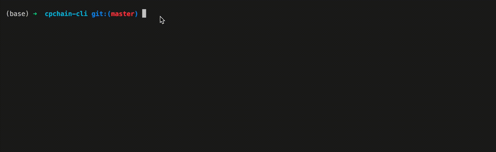

# CPChain CLI Tools

[](https://opensource.org/licenses/MIT)

This tool aim to help developer develop smart contract on CPChain mainnet.



## Usage

```bash

npm install -g cpchain-cli

cpchain-cli help

cpchain-cli create my-contract

cd my-contract

yarn

# Test contract
npx truffle test

```

## Base Contracts

The CPChain foundation has provided this [repo](https://github.com/CPChain/cpchain-dapps-utils) which has many tested base contracts. Developers can use it to develop and test smart contracts.

## Deploy on Testnet

Before deploying contract on the mainnet, we suggest developers the smart contracts on [Testnet](https://testnet.cpchain.io/#/) first to secure test. You can get Test CPC coins by the [faucet](https://testnet.cpchain.io/#/faucet). This faucet drips 100 CPC every 10 seconds. You can register your account in our queue.

### Create account

You can use the cpchain-cli create a account directly.

```bash

# create a new account
cpchain-cli account new

```

You can check your keystore in `keystore` folder. You can execute `cpchain-cli account new -h` to get detailed parameters.

### Deploy

Now, copy your address and access [faucet](https://testnet.cpchain.io/#/faucet) to get test coins. Then build your contract and deploy it on Testnet:

```bash

# build contracts
npm run build

# deploy on testnet (Specify your keystore)
cpchain-cli contract deploy --keystore <The path of your keystore> --builtContract build/contracts/MyContract.json --endpoint https://civilian.testnet.cpchain.io --chainID 41

# if need deploy multiple contracts which writes in migrations, you can use deploy-truffle command
cpchain-cli contract deploy-truffle --keystore <The path of your keystore> --endpoint https://civilian.testnet.cpchain.io --chainID 41 -P <Project Path>

```

### CPChain CLI Configuration

If you thinks the options is too many to input, you can create a file `cpchain-cli.toml`, then specify options in this file, as below:

```toml

[chain]
endpoint="https://civilian.testnet.cpchain.io"
chainID=41

[wallet]
# The path of your keystore file
keystore="keystore/key.json"
# You can specify the password in configuration (Only in DEVELOPMENT and TESTING, this is unsafe)
# password="123456"

[contract]
# built-contract is the path of the built JSON file by truffle
builtContract=""
# After the contract is deployed, you can specify this field when you need to call the contract
contractAddress=""

```

Then, when you deploy smart contracts, your commands:

```bash

cpchain-cli contract deploy --builtContract build/contracts/MyContract.json

```

### Manage Contract by Command-Line

After deploying your contract, you will need to manage it. The cpchain-cli can also support managing deployed contract. Please run as below to get all commands:

```bash

cpchain-cli contract -h

```

If you want to check options, you can use `cpcchain-cli contract view -h`, for example:

```bash

cpchain-cli contract view --builtContract build/contracts/MyContract.json --contract-address <contract address> --methodName <method name of parameter name> --parameters <parameters splited by ,>

```

*You can add `--built-contract` and `--contract-address` to the `cpchain-cli.toml` as above. Then you don't need to pass these two options in command, just run: `cpchain-cli contract view --methodName <method name>`.*

If your method needs to specify parameters, use `--parameters`.

If you want to call your contract, you can use `cpchain-cli contract call -h`, for example:

```bash

cpchain-cli contract call -c build/contracts/MyContract.json --contract-address <contract address> -m <function name> --amount <amount> -k <keystore file> --endpoint https://civilian.testnet.cpchain.io --chainID 41 --parameters <parameters splited by ,>

```

Add you can add `--amount` to specify the amount of `CPC`.

## Deploy on Mainnet

Just replace the `endpoint` and `chainID` with:

+ `endpoint`: [https://civilian.cpchain.io]
+ `chainID`: 337

## Develop

```bash

npm i

npm link

scripts/run src/index.ts -h

npm run lint

npm run lint:fix

npm run build

# publish
# npm publish

```

## Transfer CPC

You can transfer CPC by this CLI: `cpchain-cli -h`. Firstly, please create a file named `cpchain-cli.toml`:

```toml

[chain]
endpoint="https://civilian.testnet.cpchain.io"
chainID=41

[wallet]
# The path of your keystore file
keystore="keystore/key.json"
# You can specify the password in configuration (Only in DEVELOPMENT and TESTING, this is unsafe)
# password="123456"


```

Then, the commands as below:

```bash

cpchain-cli transfer --to 0x1fbBacADcD78f3508aa55bd948fE27660E58a0d2 --amount 0.9

```

## Generate Typescript Code for Using You Solidity

This tool provide a command `generate-sol-sdk` to help developers generate code in typescript. The generated code can help developers directly call the methods in solidity contract. Command as below:

```bash

yarn build

cpchain-cli generate-sol-sdk --builtContract build/contracts/Game.json

```

After executing this command, this tool will generate a file in `src/generated`, and show you a demo snippet.

## FAQ

### 为什么不用 swc 打包

因为当前版本仅支持 commonjs 打包，不支持 ES Modules（[官方文档](https://swc.rs/docs/configuration/bundling)），考虑当需跟上最新的发展，以及很多库已转向 ES Modules，故先弃用 swc 打包方式。

### Bytecode generated by truffle is different from generated by solc

[Issue](https://github.com/trufflesuite/truffle-compile/issues/77)

## References

+ [SWC](https://swc.rs/docs/getting-started)
+ [ESLint Rules](https://eslint.org/docs/rules/)
+ [CommanderJs](https://github.com/tj/commander.js)
+ [Boxen](https://github.com/sindresorhus/boxen): Create boxes in the terminal
